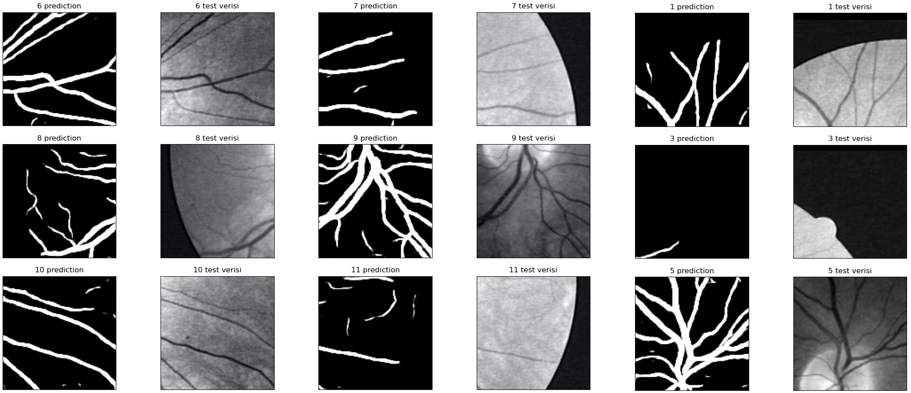
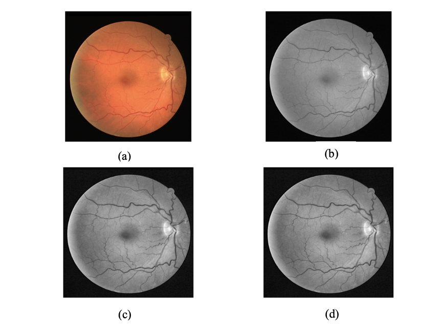
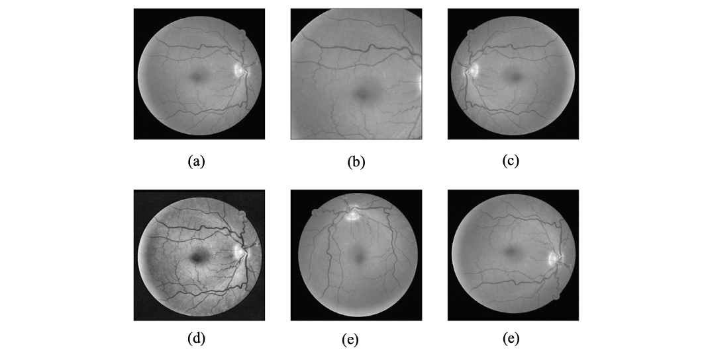
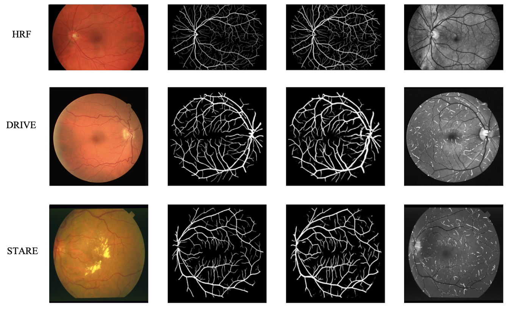
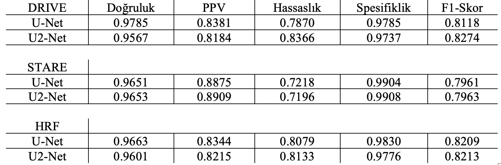
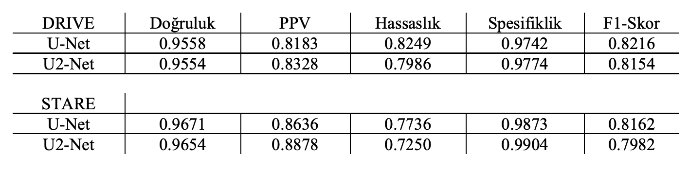
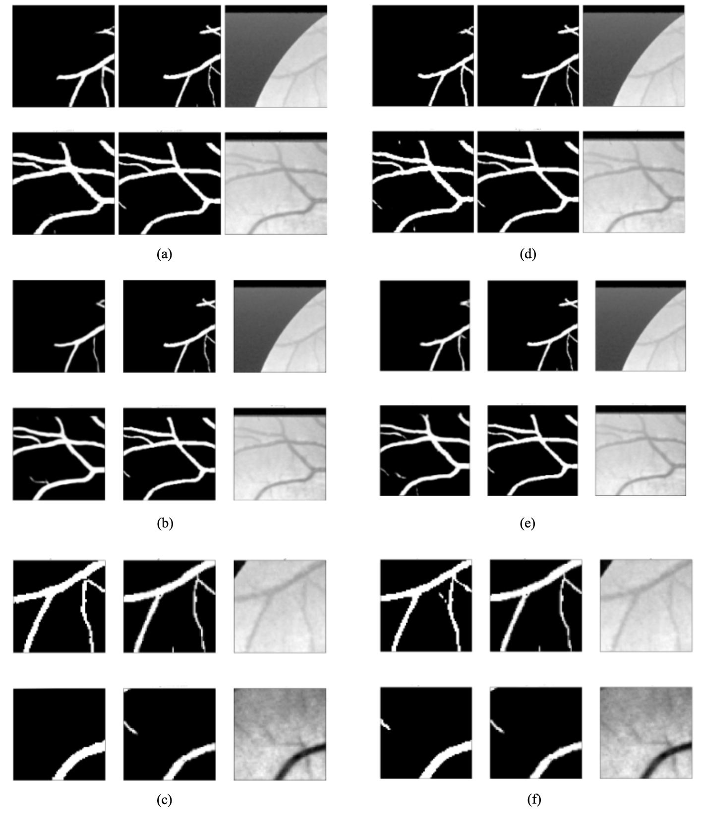

<h1 align="center">  U-Net U^2-Net MultiRes U-Net for Retinal Vessel Segmentation  </h1>

  

## Codes

The model architecture codes:

* [U-Net Model](https://github.com/knrl/UNet-USquarredNet-MultiResUNet-for-Retinal-Vessel-Segmentation/blob/main/models/unet.py)
* [USquared-Net Model](https://github.com/knrl/UNet-USquarredNet-MultiResUNet-for-Vessel-Segmentation/blob/main/models/usquarednet.py)
* [MultiRes U-Net Model](https://github.com/knrl/UNet-USquarredNet-MultiResUNet-for-Vessel-Segmentation/blob/main/models/resunet.py)

Dataset, training and test codes:

* [Extract Patch and Data Augmentation](https://github.com/knrl/UNet-USquarredNet-MultiResUNet-for-Retinal-Vessel-Segmentation/blob/main/preparation_dataset.py)
* [Train, Test, Visualization (merge images and compare prediction with test images)](https://github.com/knrl/UNet-USquarredNet-MultiResUNet-for-Retinal-Vessel-Segmentation/blob/main/train_test_visualize.py)

## Prerequisities

The following dependencies are needed:
- numpy >= 1.19.4
- tensorflow >= 2.3.1
- tqdm >= 4.52.0
- keras >= 2.4.3
- albumentations >= 0.5.2
- scikit-learn >= 0.23.2

<h2 align="center">  Deep Learning Methods for Retinal Vessel Segmentation  </h2>

Retinal vessel segmentation is popular in medical image processing and is an important topic for treatment, diagnosis and clinical evaluations. Deep learning-based methods for retinal vessel segmentation are often calculated and trained on a pixel basis, evaluating all vessel pixels with equal importance. This approach is more successful for micro vessel segmentation. In this study, U-Net model, which is the most successful deep learning model for biomedical image segmentation, and U2-Net models inspired by U-Net architecture were used. Quantitative and qualitative comparisons were made with these two models in STARE, DRIVE, and HRF data sets for retinal vessel segmentation. In order to evaluate the factors affecting the performance in vessel segmentation, the same data sets were also compared with different sizes and image processing techniques.

<h4>  Method  </h4>

U-Net architecture consists of a symmetrical U-shaped encoder and decoder. The success of the U-Net architecture is one of the jump links [1]. The output of the convolutional layer of each level is transferred to the decoder of the same level before the encoder pooling. Then the up-sampling process is transmitted to successive layers. These jump links enable the spatial information lost due to network pooling processes to be retrieved. Spatial information is important in medical image analysis applications [2]. U2-Net is a two-level nested U-Net architecture.

<h4>Method of Application</h4>

In this study, scimage, sci-kit learn, OpenCV, albumentations libraries are used for data enhancement and preprocessing with Keras using U-Net, U2-Net models Tensorflow background. Models were evaluated in low (DRIVE and STARE) and high (HRF) resolution datasets [4, 5, 6]. DRIVE and STARE were examined in two different fragment sizes and the effect of fragment size on vessel segmentation was observed. In addition, the data sets were passed through two different pre-processing stages and the effects of these stages on vessel segmentation were evaluated within the scope of models.

  <i>a. Data Pre-Processing</i> 
Each data set was divided into parts in proportion to its resolution. The DRIVE 565 × 584 has been scaled from STARE 700 × 605 to 512x512. DRIVE and STARE data sets are chosen into two different patch sizes, 128x128 and 64x64. The resolution of the HRF data set is higher than the other data sets. The HRF was scaled from 3504x2336 to 3456x2304 and patch size 128x128.

  
  
<i>Figure 1. (a) Original image; (b) Green channel; (c) CLAHE; (d) Gamma correction</i>

  <i>b. Vessel Enhancement</i> 
In retinal images, the green channel exhibits the best vessel and background contrast, while the red and blue ones tend to be very noisy [7]. The first preprocessing approach used in the study is to take the green channel from each visual and normalize it. The normalized visuals obtained from the green channel were enhancement by applying gamma correction after CLAHE (Figure 1) [8].

  
  
<i>Figure 2. Data Augmentation; (a) Original image; (b) Random cropping; (c) Horizontal flipping; (d) CLAHE filter; (e) Vertical flip; (f) Random rotation</i>

    <i>c. Evaluation and Metric Selection</i> 
The 5 most frequently used metrics for retinal vessel segmentation in the literature were used [9]. These; accuracy, sensitivity, specifity, precision, ppv, f1-score. In the evaluation phase, only the fovea area was calculated. Since the STARE data set does not contain a mask image, mask images produced for the STARE data set were used in another study [10]. In order to make observational comparison, the tagged visuals are overlaid with the prediction images and each pixel is marked with white for erroneous predictions. A threshold value of 0.5 was applied for the predicted pixels.

      <i>d. Experiment details</i> 
The data set is divided into 70% training and 30% testing. During the training, the validation set was chosen as 1% each time. For both models, Adam optimizer and binary cross entropy loss function, learning ratio 0.001 are used. Training 20, 50, 100, 200, 500, 1000 epochs have been tried. In general, after 50 epochs in data sets, the difference between loss and assessment loss ratio started to increase. The epoch results of 50 to 70 were evaluated to obtain the best values.

  
  
<i>Figure 3. Original, prediction, ground truth and overlap images</i>

<h4>Conclusion and Discussion</h4>

In biomedical image segmentation such as retinal vessel segmentation, pixel-based comparison is important for equally evaluating thick and thin vessels. It is important to preserve the spatial information in the image during feature extraction. U-Net is successful in this sense thanks to the skip connections between the encoder and decoder layers. In addition to these features of U-Net, U2-Net better captures local and holistic information of both shallow and deep layers, regardless of resolutions [3]. From the results we obtained, it has been shown that the pre-processing stage and the part size are as important as the model used for retinal vessel segmentation. In retinal vessel segmentation, it can be difficult to understand the success of micro vessel segmentation from quantitative metrics, as a large part of the image contains thick veins and black background (Figure 3).

  

  
<i>Table 1. 128x128 patch size and CLAHE, gamma correction; Accuracy, PPV, Recall, Specifity, F1-Score</i>

  
  

  
<i>Table 2. 64x64 patch size and CLAHE, gamma correction; Accuracy, PPV, Recall, Specifity, F1-Score</i>

 
   

 
  
<i>STARE data set; (a) U-Net 128x128 green channel and normalization; (b) U-Net 128x128 CLAHE and Gamma correction; (c) U-Net 64x64 CLAHE and Gamma correction; (d) U2-Net 128x128 green channel and normalization; (e) U2-Net 128x128 CLAHE and Gamma correction; (f) U2-Net 64x64 CLAHE and Gamma correction</i>

  

    

  
  
<h4>References</h4>

[1] Ibtehaz, N., Rahman, M. S. “MultiResUNet: Rethinking the U-Net architecture for multimodal biomedical image
segmentation,” Neural Networks, vol. 121, pp. 74-87, 2020. 
[2] Hajnal, J. V., Hill, D. L. (Eds.). “Medical image registratio,” CRC press, 2001. 
[3] Qin, X., Zhang, Z., Huang, C., Dehghan, M., Zaiane, O. R., Jagersand, M. “U2-Net: Going deeper with nested U-structure for
salient object detection,” Pattern Recognition, vol. 106, 2020. 
[4] Staal, J., Abràmoff, M. D., Niemeijer, M., Viergever, M. A., Van Ginneken, B. “Ridge-based vessel segmentation in color
images of the retina,” IEEE transactions on medical imaging, vol. 23, no. 4, pp. 501-509, 2004). 
[5] Hoover, A. D., Kouznetsova, V., Goldbaum, M. “Locating blood vessels in retinal images by piecewise threshold probing of a
matched filter response,” IEEE Transactions on Medical imaging, vol. 19, no. 3, pp. 203-210, 2000. 
[6] Budai, A., Bock, R., Maier, A., Hornegger, J., Michelson, G. “Robust vessel segmentation in fundus images,” International
journal of biomedical imaging, 2013. 
[7] Ricci, E., Perfetti, R. “Retinal blood vessel segmentation using line operators and support vector classification,” IEEE
transactions on medical imaging, vol. 26, no. 10, pp. 1357-1365, 2007. 
[8] Jin, Q., Meng, Z., Pham, T. D., Chen, Q., Wei, L., Su, R. “DUNet: A deformable network for retinal vessel
segmentation,” Knowledge-Based Systems, vol. 178, pp. 149-162, 2019. 
[9] Moccia, S., De Momi, E., El Hadji, S., Mattos, L. S. “Blood vessel segmentation algorithms—review of methods, datasets and
evaluation metrics,” Computer methods and programs in biomedicine, vol. 158, pp. 71-91, 2018. 
[10] Son, J., Park, S. J., Jung, K. H. “Retinal vessel segmentation in fundoscopic images with generative adversarial
networks,” 2017. 
  

